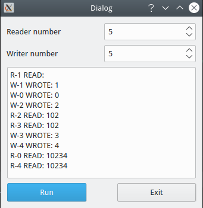

# Readers–writers problem

It's a GUI implementation of Readers–writers problem based on Qt5.

## Screenshots



## Requirement (Recommend)

- cmake >= 3.16
- qt5 >= 5.14
- g++ >= 9.3

## Build

```shell script
cd <path/to/SZU-LearnOS/>
cmake -B build
make
# generated binary file is build/exp-1/reader_writer
```
